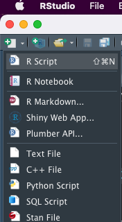
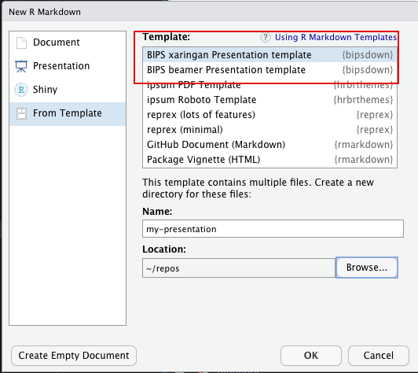
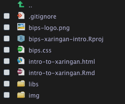
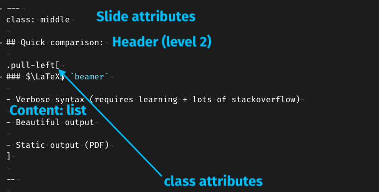

```{r setup, include=FALSE}
# This chunk is not visible in the presentation
# Use it to set up misc. options for your code/output
library(ggplot2)
library(plotly)
library(palmerpenguins)

# knitr chunk options for all chunks
knitr::opts_chunk$set(
  echo = TRUE,          # Set FALSE to hide R code
  messages = FALSE,     # No messages from e.g. package loading
  warning = FALSE,      # Don't show warnings from R code
  dev = "ragg_png",     # Higher quality png graphics device
  fig.align = "center", # Centered plots (recommended)
  fig.retina = 2        # Higher image quality for high resolution screens
)

# xaringanExtra features, see https://pkg.garrickadenbuie.com/xaringanExtra/
xaringanExtra::use_xaringan_extra(
  c("tile_view", "clipboard")
)

xaringanExtra::use_extra_styles(
  hover_code_line = TRUE,
  mute_unhighlighted_code = FALSE
)
```

# {xaringan} with BIPS styles

This is a BIPS-theme for the [`{xaringan}`](https://slides.yihui.org/xaringan/) RMarkdown presentation format developed by Yihui Xie.  

### Find it on GitHub at [`github.com/bips-hb/bipsdown`](https://github.com/bips-hb/bipsdown)


---
class: middle, center, inverse

# {xaringan}: What and Why?

---
class: middle

## xaringan (/ʃæ.'riŋ.ɡæn/)

- **RMarkdown** format based on `remark.js` for HTML presentations

--

- Alternative to $\LaTeX$/Beamer PDF slides

--

- Allows interactive/animated content and easy web-based sharing and embedding.

--

- You can use math *mostly* as you would with $\LaTeX$, but with some caveats.

---
class: middle, center
## "But I like `beamer` 🙁"

--

That's okay. But can `beamer` do this?

--

.pull-left[
```{r norm3d, echo = FALSE, fig.align='center'}
plotly_default_conf <- function(p) {
  config(p,
    staticPlot = FALSE, displayModeBar = TRUE,
    editable = FALSE, sendData = FALSE, displaylogo = FALSE,
    modeBarButtonsToRemove = list(
      "toImage",
      "sendDataToCloud",
      "editInChartStudio",
      "hoverCompareCartesian",
      "hoverClosestCartesian",
      "select2d",
      "lasso2d",
      # "zoom2d",
      "zoomIn2d", "zoomOut2d",
      "resetViews", "resetScale2d",
      "toggleSpikelines"
    )
  )
}

xdat <- c(36.4, 37.2, 35.8, 36.4, 37.1, 35.6, 36.4, 37.6, 37.5, 37.1)
xdf <- tibble::tibble(
  mu = seq(35, 38, length.out = 100),
  sd = rev(seq(0.2, 1.3, length.out = 100))
)

loglik_norm <- function(mu, sd, x) {
  prod(dnorm(x, mean = mu, sd = sd))
}
vec_loglik_norm <- Vectorize(loglik_norm, vectorize.args = c("mu", "sd"))
z <- outer(xdf$mu, xdf$sd, FUN = vec_loglik_norm, x = xdat)

plot_norm <- plot_ly(
  data = xdf, y = ~mu, x = ~sd, z = z, type = "surface"
) %>% 
  layout(
    scene = list(
      xaxis = list(title = "\u03c3"),
      yaxis = list(title = "\u00b5"),
      zaxis = list(title = "Likelihood")
    ),
    paper_bgcolor = "#FFF",
    plot_bgcolor = "#FFF"
  ) %>%
  plotly_default_conf

plot_norm
```
]

.pull-right[
That's a `{plotly}` 3D plot, rendered with R and embedded as an `htmlwidget`
]

---
class: middle

## Standard RMarkdown goodness!

```{r, fig.width=8, fig.height=4}
library(palmerpenguins)
library(ggplot2)

ggplot(data = penguins, aes(x = bill_length_mm, y = flipper_length_mm, fill = species)) +
  geom_point(shape = 21, color = "black") +
  scale_fill_brewer(palette = "Dark2") +
  hrbrthemes::theme_ipsum_ps()
```


---
class: middle

## Quick comparison:

.pull-left[
### $\LaTeX$/`beamer`

- Verbose syntax (requires learning + lots of stackoverflow)

- Beautiful output

- Static output (PDF)
]

--

.pull-right[
### remark.js

- Compact syntax (stackoverflow required for CSS)

- Beautiful output (kind of)

- Dynamic output (HTML/CSS/JS)

- Allows interactivity and dynamic content
]

--


.footnote[Of course, both get infinitely cooler when used with RMarkdown 😎]

---
class: center
# Using {xaringan}

Step 1: `remotes::install_github("bips-hb/bipsdown")`

Step 2: Use the RMarkdown template:

.pull-left[

]
.pull-right[

]

---
class: middle
## Beware the folder structure!

.pull-left[
.center[

]]

.pull-right[
Template will create a subfolder with files, but that messes up relative file paths for the logo ☹  

Move the newly created files to the project root like on the left.
]

.footnote[I'm still looking into better solutions to "package" the template for easier use]

---

## Making slides

{xaringan}/remark.js use a variation of Markdown - You can learn it in 60 seconds on the [CommonMark website](https://commonmark.org/help/)

--

- Slides are delimited with `---`
- Define attributes for the whole slide with `class:`
- Incremental steps with `--` an a line with empty lines around it

.center[]

---

## Styling

- Both `class:` and `.pull-{left,right}[ ]` attach .bipsorange[CSS] classes

--

- Theme-specific CSS definitions live in `bips.css`, and you can add your own!

--

.pull-left[

```css
.bipsblue {
  color: #1763AA;
}

.shout {
  text-transform: uppercase;
}
```
]

.pull-right[

This is my `.bipsblue[blue text]`  
This is my .bipsblue[blue text]

This is `.shout[a very loud sentence]`  
This is .shout[a very loud sentence]

]

--

.footnote[When in doubt, W3Schools: https://www.w3schools.com/cssref/pr_text_text-transform.asp]

---
class: middle
## {xaringan}'s best feature: Infinite moon reader!

(this is where I try to live-demo things and hope nothing breaks too badly)

---
class: middle

## A lot of further reading (sorry)


- [{xaringan} in the RMarkdown book](https://bookdown.org/yihui/rmarkdown/xaringan.html)

- [{xaringan} documentation presentation](http://slides.yihui.name/xaringan/)

- [Bonus features in {xaringanExtra} by Garrick Aden-Buie ({xaringan}-wizard)](https://pkg.garrickadenbuie.com/xaringanExtra/#/README?id=xaringanextra)

- [His talk which is basically this talk but good](https://slides.garrickadenbuie.com/sliding-in-style/)


---
class: center, middle, thanks
background-image: none

# Thank you for your attention

### [www.leibniz-bips.de/en](https://www.leibniz-bips.de/en)

.pull-left[.right[
#### Contact  
.bipsblue[`r rmarkdown::metadata$contactauthor`]  
Leibniz Institute for Prevention Research and Epidemiology - BIPS GmbH  
Achterstraße 30  
D-28359  
.bipsblue[`r rmarkdown::metadata$contactemail`]
]]
.pull-right[

```{r end-bips-logo, echo = FALSE, out.width = "50%"}
knitr::include_graphics("bips-logo.png")
```

]
